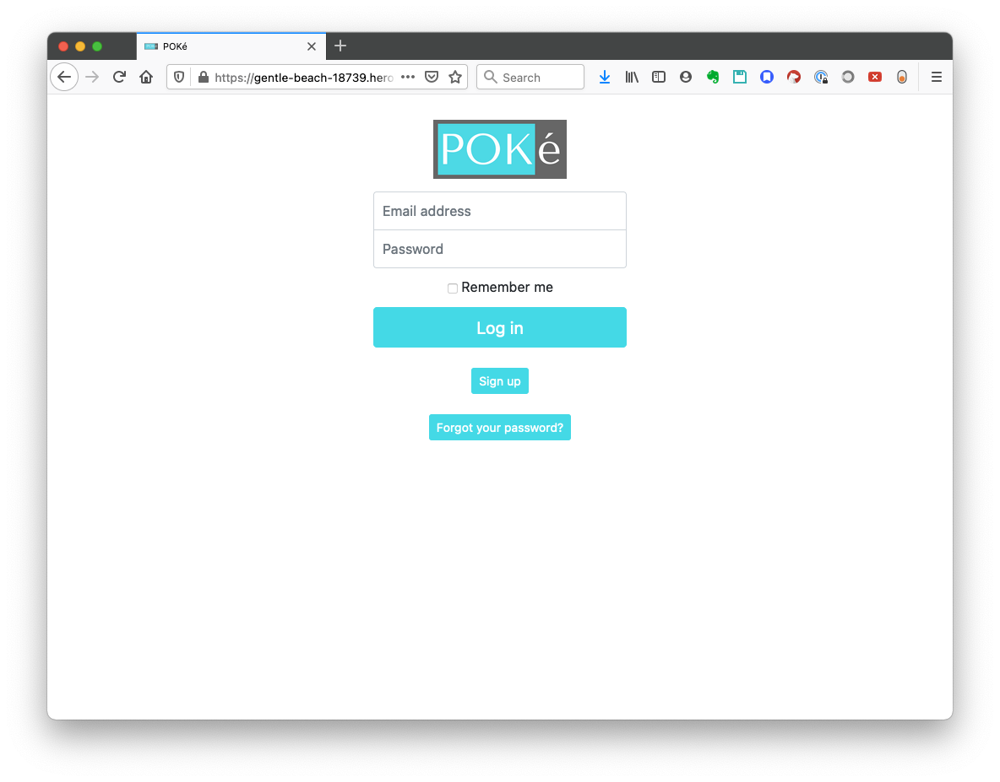
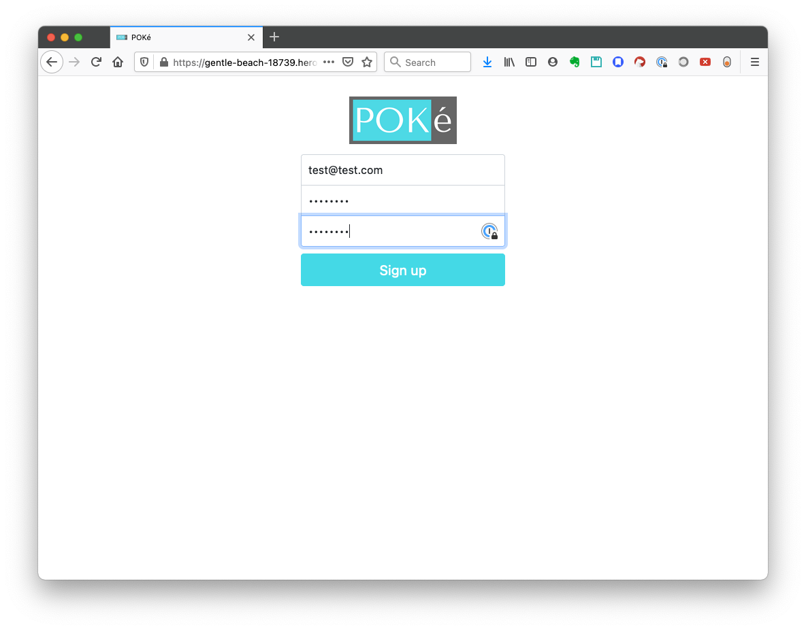
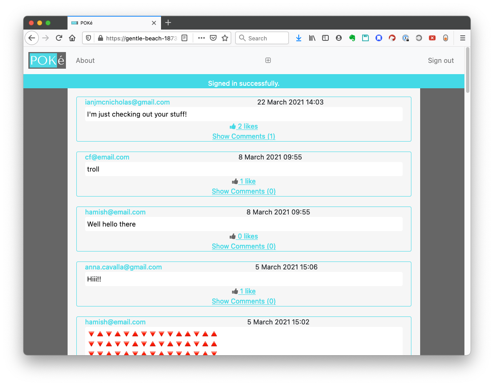
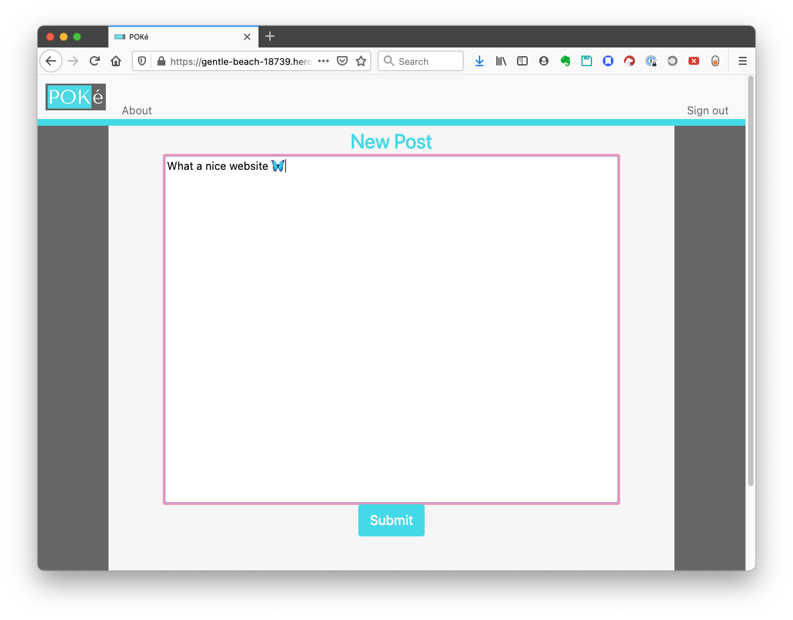
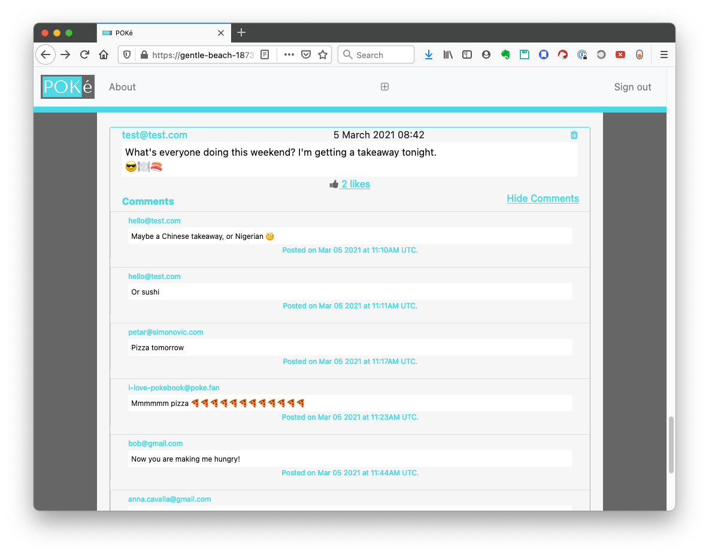
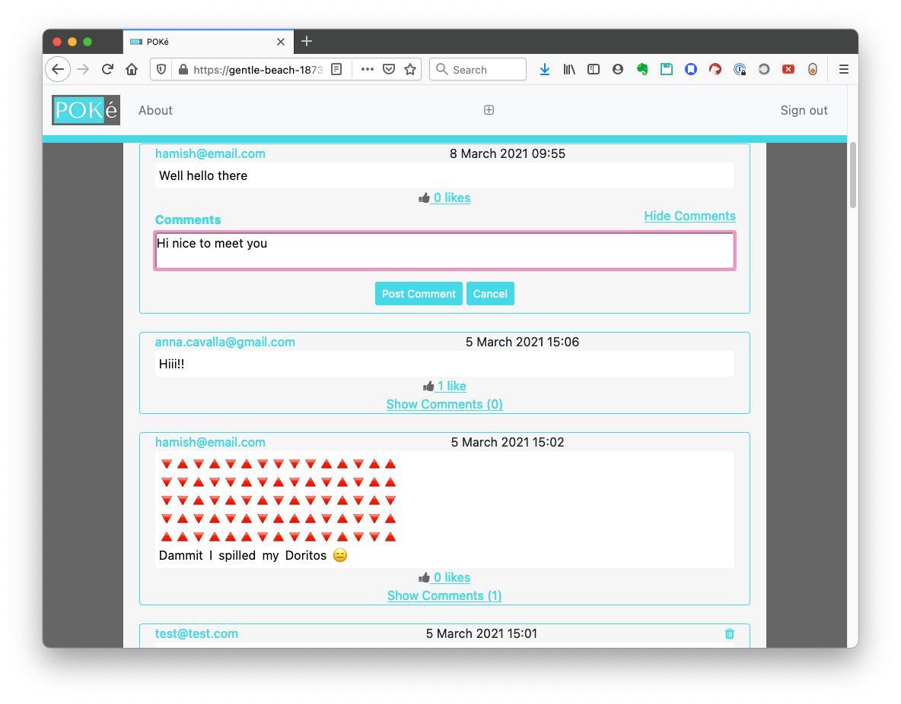

# AceBook
A Facebook-inspired social messaging platform, where users can post their thoughts, and like and comment on posts.

[About the app](#about-the-app)  
[Using the app](#using-the-app)  
[Installation and development](#installation-and-development)  
[Known issues](#known-issues)  

### About the app
This was a team project built in two weeks as part of the [Makers Academy](http://makers.tech) coding bootcamp. The brief was to create a Facebook clone using Ruby on Rails, a framework new to all of us. We were given a Rails project skeleton to work from.  
  
To develop the app, we followed the client requirements in deciding what features to focus on. We took advantage of several existing gems (libraries) to simplify our work.  
* [Devise](https://github.com/heartcombo/devise) for users and user authentication
* [Acts-as-favoritor](https://github.com/jonhue/acts_as_favoritor) for the Likes functionality
* [Commontator](https://github.com/lml/commontator) for adding Comments to posts
* JavaScript for dynamically adding Likes and Comments without reloading the page
* pg / PostgreSQL database to allow deployment on Heroku
* [Bootstrap](https://getbootstrap.com/) for styling

The deployed app is [here](https://gentle-beach-18739.herokuapp.com/).  

The colour scheme was developed using [Coolors](https://coolors.co/) and the logo was made with [Canva](https://www.canva.com/en_gb/).  
  
No further development is planned for this app.  
  
### Using the app
Try out Acebook [here](https://gentle-beach-18739.herokuapp.com/).  

<figure style="margin: auto">
<figcaption>On arriving at the homepage, users are asked to sign in or register. Non-signed in users can't see any posts.</figcaption>

</figure> 

<figure style="margin: auto">
<figcaption>Registering an account.</figcaption>

</figure> 

<figure style="margin: auto">
<figcaption>After registration, users see a page of interesting posts from other users.</figcaption>

</figure> 

<figure style="margin: auto">
<figcaption>The user can post their own messages as well. If they change their mind about what to say, there's a 10 minute window in which to edit the post. Otherwise, it's always possible to delete one's own posts. But never possible to delete or edit someone else's.</figcaption>

</figure> 

<figure style="margin: auto">
<figcaption>They can like a post (one Like per post) or add a comment. Likes and comments are added dynamically, using vanilla JavaScript.</figcaption>

</figure> 

<figure style="margin: auto">
<figcaption>Writing a comment. It's possible to delete their own comments, but not other users' comments.</figcaption>

</figure> 

### Installation and development
This project was written using Ruby v2.7.2 and Rails 5.1.1.  
To run the code you will need to have Node.js installed as well as Bundler.  
  
To run locally:
1. Clone this repo onto your own machine.
1. Run `$ bundle install` to install the required gems.
2. Run `$ rails db:create` to create the PostgreSQL databases.
3. Run `$ rails db:schema:load` to create the database tables.
4. Run `$ rails server` to run the project locally on `localhost:3000`.
  
To run tests:
1. Run `$ rspec` after the database creation to run the test suite.
  
### Known issues
This app has been tested on desktop browsers (Chrome v88, Firefox v85) and is not optimised for mobile browsers. The Sign out button is not visible on mobile.

